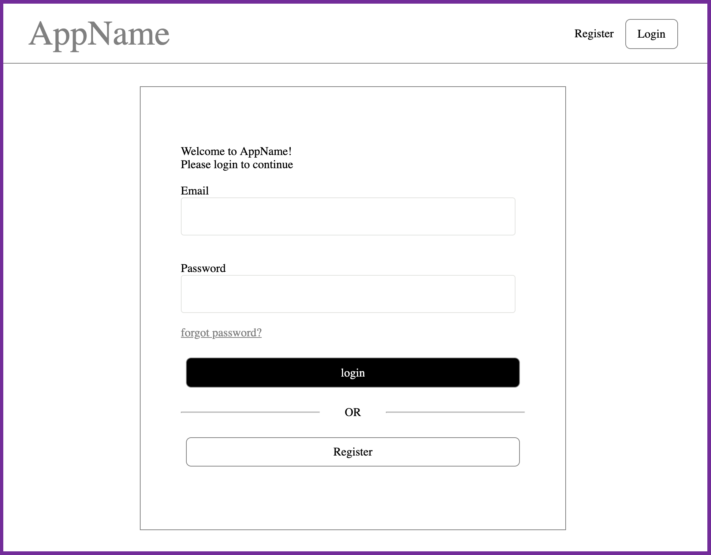
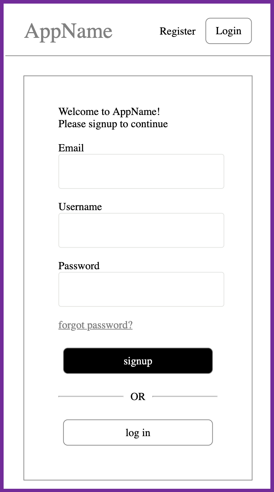

# Rails User Auth

A relatively easy to install and use **user authorization for people in a hurry**.

## Tech stack
- Database: PostgreSQL
- Backend: Ruby on Rails
- Frontend: React, Redux, SASS

## Noticeable Features
- Mobile / tablet friendly responsiveness
- Email confirmation
- Password reset
- SMTP email sending mechanism
- BEM CSS naming convention
- 7-1 SASS file structure
- Minimalistic design

## Images
- PC view:



- Mobile view:



- Note: These images have a purple border (the actual app doesn't)

## Installation
1. [Install Rails](http://installrails.com/) if you don't have it
2. [Install PostgreSQL](http://postgresguide.com/setup/install.html) if you don't have it
3. In terminal:
    1. Go to project directory
    2. `bundle install`
        1. Installs Rails dependencies
    3. `npm install`
        1. Installs needed npm packages
    4. `rails db:setup`
        1. Sets up database

## Usage
1. In terminal:
    1. Go to project directory.
    2. `rails g rename:into New-Name`
        1. Replace "` New-Name `" with your app's name.
2. In code editor:
    1. Replace-all "AppName" with your app's name.
    3. Go to `config/application.yml`
       1. Place this code snippet at bottom of file:
          1. Replace `'example@gmail.com'` with your email
          2. Replace `'1234567'` with your email's password
        -  Side note: This file is [git ignored](https://guide.freecodecamp.org/git/gitignore/) so you don't have to worry about it getting shared on Github =)
```Ruby
api_key: 'API Key'
domain: 'Domain'
gmail_username: 'example@gmail.com'
gmail_password: '1234567'
```
3. In terminal (each in separate tab):
    1. `bundle exec rails jobs:work`
    2. `rails s`
    3. `npm start`

## Contributing
Pull requests are welcome. For major changes, please open an issue first to discuss what you would like to change.

## Trouble
If you get stuck, and you aren't sure what to do, please don't hesitate to email me at Hakeemmidan@gmail.com with your issue.

I will try to get back to you within 1 to 2 business days.

## License
[MIT](https://choosealicense.com/licenses/mit/)
